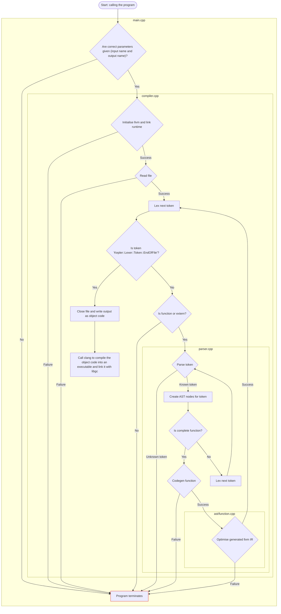
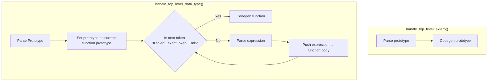
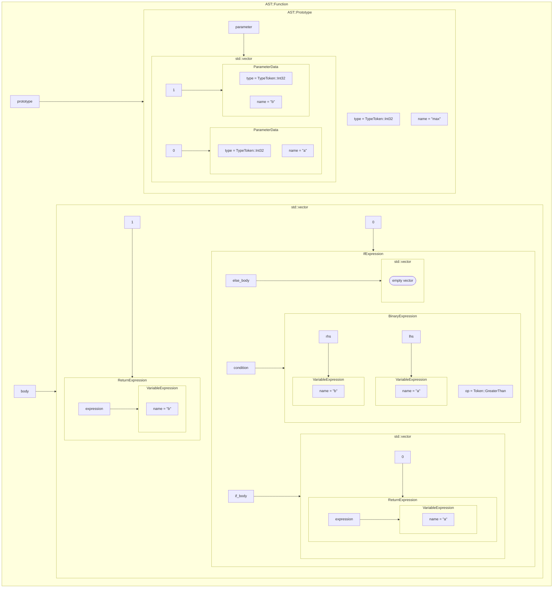
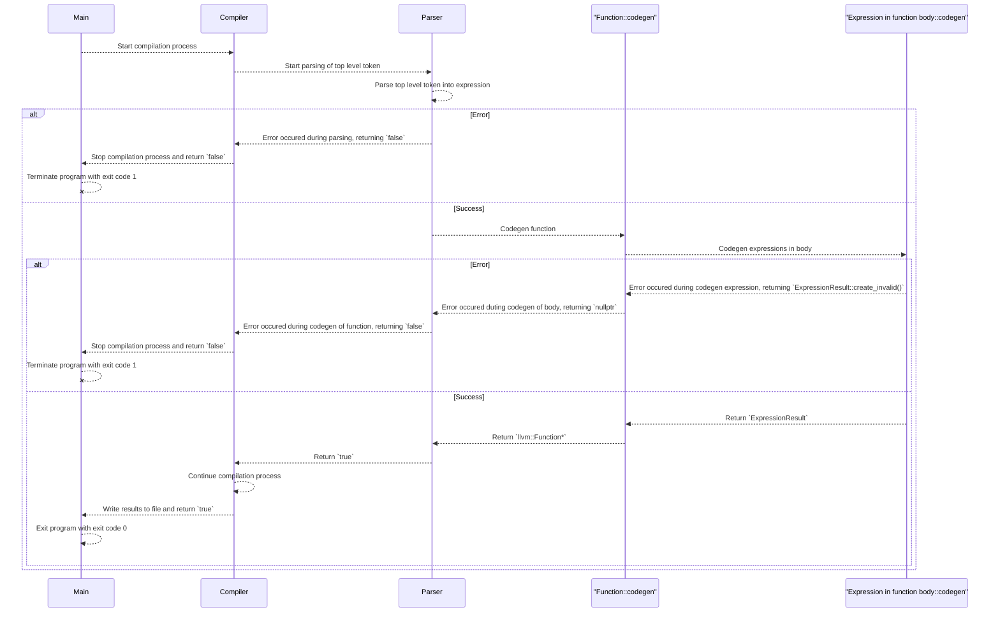

# Technical documentation

The project uses [LLVM](https://llvm.org/docs/tutorial/MyFirstLanguageFrontend/index.html) in order to create the compiler for the language.

> [!important]
> The general functionality of the compiler was made by following the [official LLVM tutorial](https://llvm.org/docs/tutorial/MyFirstLanguageFrontend/index.html), which is why their base architecture is the same.

## 1. Project structure

The following graph displays the project structure, showing the most important files and folders.

```
external                                # Contains included third party libraries
└─ cxxopts                              # Used for handling the command line arguments
src                                     # Contains the source code of the project
├─ ast
│  ├─ expression.hpp                    # Base class of every expression (has a virtual method called "codegen" to override)
│  ├─ expression_result.cpp             # Contains the result of "codegen" alongside flags that indicate the status of the result
│  ├─ function.cpp                      # AST node that contains a prototype and a function body
│  ├─ prototype.cpp                     # AST node that contains a function signature
│  └─ ... all of the expressions        # Rest of the ast nodes, all inheriting from "expression.hpp"
├─ function_registry
│  └─ function_registry.cpp             # Contains a map of all registered prototypes
├─ runtime
│  ├─ runtime.cpp                       # Reads the embedded runtime back into an "llvm::Module" and registers the runtime functions in the function registry
│  └─ runtime.c                         # Contains the runtime functions, which are embedded into the compiler
├─ types
│  ├─ target_type_stack.cpp             # Contains the type a current expression should generate
│  ├─ type.cpp                          # Contains a mapping of internal types to llvm::Type* and the casting system
│  ├─ data_type.hpp                     # Base class of every data type (has virtual functions for creating all of the supported operations to override)
│  └─ ... all if the types              # Rest of the data types, all inheriting from "data_type.hpp"
├─ variables
│  └─ local_variables.cpp               # Contains a map of all local variables inside the current function
├─ compiler.cpp                         # Initialises llvm, links the runtime, reads the input file and handles the compilation process
├─ lexer.cpp                            # Maps text to internal tokens
├─ main.cpp                             # Entry point of the application
├─ parser.cpp                           # Creates the AST nodes based on the lexer's tokens
└─ optimiser.cpp                        # Contains the llvm optimisation passes
```

## 2. Project flow



## 3. Core architecture

The core architecture revolves around streaming an input file character by character while lexing, parsing and generating LLVM IR as the file is streamed.
Once this process is complete, the resulting LLVM IR is compiled into native machine code and written to the specified output file, ending it with the `.o` file extension.
After that, the compiler calls `clang` to compile the object file into an executable and to link it with `libgc`.

The four components that enable this behaviour are described in the following sections.

### 3.1 Lexer (`src/lexer`)

The lexer reads the input file character by character and translates the characters into tokens.

If an unknown character is encountered, the lexer returns the token `Token::Unknown`, which leads to the safe termination of the program.

#### 3.1.1 Lexing literals

When lexing a literal, the lexer creates the corresponding token and stores the actual value of the literal in a variable.
The parser can then access this variable when the respective `Expression` is created.

Since the lexer doesn't know which type the literal's value will target during code generation (e.g. an integer literal could have to be generated to an `i8` or an `i64`), it uses the largest C++ data type to store the value (e.g. `int64_t` for an integer literal) to avoid potential data loss.

#### 3.1.2 Lexing data types

When lexing a data type, the lexer returns a general token called `Token::DataType` and stores the actual internal type as a `TypeToken` in a variable (similar to how the lexer stores the values of literals).
This is because I wanted to keep the type tokens separate from the lexer tokens.

#### 3.1.3 Single-charater lookahead

The lexer uses a single-character lookahead, meaning that once it recognises a token, it reads the next character before returning that token.
This is because, in order to lex certain tokens (e.g. identifiers, which only allow alphanumeric characters and underscores), the lexer needs to read characters until an invalid character is encountered.
This results in the next character already being read by the time the token is recognised.
Since the lexer has to consistently lex tokens, the entire lexer is programmed to use a single-character lookahead.

This behaviour could, of course, be avoided by peeking at the next character without reading it, reading it only if it is a valid character. However, this would result in a performance loss, which is why the single-character lookahead is used instead.

### 3.2 Parser(`src/parser`)

The parser exposes two functions that handle the two possible top-level AST nodes (`externs` and `functions`).
These functions stream the tokens from the lexer until an AST node is created, after which they immediately start the code generation process for the newly created node.



The code generation process is started immediately after parsing has finished because, as top-level expressions, `externs` and `functions` have no dependencies when it comes to generating their LLVM IR.
Therefore, generating them immediately avoids unnecessarily storing all the AST nodes created.

#### 3.2.1 Parsing a prototype

A prototype is the signature of a function: `<return_type> <name>(<arguments>)`.
Parsing a prototype just records the `<return_type>`, `<name>` and arguments, which are defined after the pattern `<arg_type> <arg_name>`, into an `AST::Prototype`.

Each parsed prototype is immediately registered in the [`FunctionRegistry`](#6-function-registry-srcfunction_registryfunction_registrycpp)).

#### 3.2.2 Parsing an expression

The parser always tries to parse expressions as a `BinaryExpression`.

Initially, every expression is treated as a left-hand side expression.
Once parsed, a precedence of 0 is assigned to the expression and the parser checks the precedence of the next token by accessing a map of the known binary operators.
This map assigns a precedence to every operator in order to ensure correct operator precedence (the values themselves are kind of arbitrary (and straight up copied from the [LLVM tutorial](https://llvm.org/docs/tutorial/MyFirstLanguageFrontend/LangImpl02.html#binary-expression-parsing)), but their distance is important as there has to be a bit of space between the values).

If the token is a known binary operator, the precedence is higher than 0 and thus the entire expression is a `BinaryExpression` (`<initial_expression> <binary_operator> <rhs_expression>`).
The right-hand side expression is then parsed, after which this process is repeated (with a few additional checks to ensure operator precedence) until the next token is not present in the binary operator map.

If the token is not present in the binary operator map, its precedence defaults to -1, which means that the expression is finished and it is returned without further processing.

##### 3.2.2.1 Ensuring operator precedence

In order to ensure operator precedence, after parsing the right-hand side expression, the parse checks the precedence of the next token.

- The next token has a lower precedence than the current binary operator:\
The parser creates a `BinaryExpression` with the current operator, the current left-hand side and right-hand side expressions and treats this newly created `BinaryExpression` as the left-hand side expression before checking the precedence of the next token (without changing the precedence of the expression).
- The next token has a higher precendence than the current binary operator:\
The parser treats the current right-hand side expression as the left-hand side expression before checking the precedence of the next token (with a precedence of `precedence of current binary operator + 1` for the left-hand side expression).

This process is repeated until the next token is not present in the binary operator map.

### 3.3 Abstract syntax tree (AST) (`src/ast/...`)

There are three different types of AST nodes.
All three of these node types have a method called `codegen`, which generates the LLVM IR for the respective node.

| Node type | Usage |
| :- | :- |
| `Expression` | An abstract class from which all other expressions inherit. Inheriting classes override the abstract method `codegen`. |
| `Prototype` | The signature of a function, see [parsing a prototype](#321-parsing-a-prototype) |
| `Function` | Consists of a `Prototype` and a list of `Expressions` that form the function body |

### 3.4 Compiler (`src/compiler`)

The compiler is the main interface of the application that handles the entire compilation process.
After the application arguments (the input file name and the output file name) have been verified, the compiler initialises LLVM, links the runtime and opens the input file.
It then reads the first token from the lexer and decides which top-level handling method from the parser should be called.

This process is repeated until the next token is `Token::EndOfFile`.
Once this token is encountered, the compiler closes the input file verifies the LLVM module that was used to generate the code.
If the verification is successful, the IR of the module is compiled into native machine code and written to the specified output file.

### 3.5 Example

This section provides a look at each step of the compilation process.

#### 3.5.1 Source code

```
i32 max(i32 a, i32 b)
  if (a > b)
    return a
  end
  return b
end
```

#### 3.5.2 Lexer tokens

As mentioned in [3.1.1 Lexing literals](#311-lexing-literals) and [3.1.2 Lexing data types](#312-lexing-data-types), the lexer sometimes stores additional data alongside the tokens.
This additional data is displayed in brackets after the respective token in the example.

```
DataType(TypeToken::Int32) Identifier("max") BracketOpen DataType(TypeToken::Int32) Identifier("a") Comma DataType(TypeToken::Int32) Identifier("b") BracketClose
  If BracketOpen Identifier("a") GreaterThan Identifier("b") BracketClose
    Return Identifier("a")
  End
  Return Identifier("b")
End
```

> [!note]
> The tokens are only indented to make it clearer which part of the source code they belong to.
> In reality, it's a stream of tokens.

#### 3.5.3 AST nodes



#### 3.5.4 Resulting (unoptimised) LLVM IR

```llvm
define i32 @max(i32 %a, i32 %b) {
entry:
  %b2 = alloca i32, align 4
  %a1 = alloca i32, align 4
  store i32 %a, ptr %a1, align 4
  store i32 %b, ptr %b2, align 4
  %a3 = load i32, ptr %a1, align 4
  %b4 = load i32, ptr %b2, align 4
  %gttmp = icmp sgt i32 %a3, %b4
  br i1 %gttmp, label %ifbranch, label %elsebranch

ifbranch:                                         ; preds = %entry
  %a5 = load i32, ptr %a1, align 4
  ret i32 %a5

elsebranch:                                       ; preds = %entry
  br label %afterbranch

afterbranch:                                      ; preds = %elsebranch
  %b6 = load i32, ptr %b2, align 4
  ret i32 %b6
}
```

#### 3.5.5 Resulting (optimised) LLVM IR

```llvm
define i32 @max(i32 %a, i32 %b) {
entry:
  %a.b = call i32 @llvm.smax.i32(i32 %a, i32 %b)
  ret i32 %a.b
}
```

## 4. Type system

LLVM itself is statically typed with almost no implicit type conversions (afaik, the only exceptions to this are some values to booleans, e.g. integer to booleans, which can happen implicitly).
This means that when creating an `llvm::Value*` (e.g. creating constant values, creating binary operations, ...), the `llvm::Type*` of the `llvm::Value*` has to be known.

The type system of this compiler is based on internal tokens, which are mapped to their respective `llvm::Type*` during code generation.
This makes it easy to compare types at compile time in order to check for type mismatches, as comparing two enum values is arguably easier than comparing two `llvm::Type*`.

### 4.1 The internal representation

The internal representation of types is an enum called `TypeToken` found in `src/types/types.hpp`.
It contains all supported types as well as the special type `TypeToken::None`, which is used to let literal expressions decide their internal target type by themselves (this is needed because sometimes multiple internal types are represented through the same literal expression (e.g. all integer types are represented through an `IntegerValueExpression`).
In some cases where the target type is unknown (e.g. at the beginning of the condition of an `IfExpression`), the literal expression has to choose a default type by itself).

### 4.2 Storing target types vs. determining them during code generation

There are two different ways an expression can retrieve its target type:

- Storing the target type somewhere while parsing
- Determining the target type based on the resulting type of the previous expression during code generation (e.g. after generating the left-hand side expression of a `BinaryExpression`, the target type of the right-hand side expression is the generated type of the left-hand side expression)

#### 4.2.1 Storing target types while parsing

The target types of expressions are stored in different places depending the kind of expression being parsed:

- The return type of a `Function` is stored in its `Prototype`, which is added to the `FunctionRegistry`
- The type of a local variable is stored inside of its `VariableData`, which is added to the `LocalVariables` variable map
- `CastExpressions` and `VariableDefinitionExpressions` store their target type within the expression

In these cases, the corresponding expression accesses the stored type during code generation and uses it as its target type without further processing.
If the code generation was successful, the expression then returns the stored type inside its `ExpressionResult`, which can then be used by other expressions that don't store their target type while parsing.

#### 4.2.2 Determining target types during code generation

Some expressions don't know their target type while parsing because it's not explicitly specified (e.g. `x = 3 + 5` -> the two `IntegerValueExpressions` don't know which kind of integer or float they should use as their target type)
Normally, this is where type deduction would come into play.
However, because of time constraints, I wasn't able to implement full on type deduction, which is why I chose a different approach that works fine in most cases, but leads to [some issues when `TypeToken::None` is on the `TargetTypeStack`](./known_issues.md#1-compile-errors-because-of-no-type-deduction).

In cases where expressions need to find out their target type during code generation, they peek at the top of the `TargetTypeStack`, which is an `std::stack<TypeToken>`.
The way this system works is that some expressions contain other expressions (e.g. a `ReturnExpression` contains an expression that generates the value to return).
The containing expressions know what type their contained expressions should generate, so they push that type onto the `TargetTypeStack` before generating the contained expressions and then pop it from the stack once the generation is complete.
The contained expressions can then peek at the top of the `TargetTypeStack` during code generation to find out their target type.

### 4.3 Casting

The type system exposes a method called `cast(llvm::Value* value, TypeToken from, TypeToken to)`.
This method consists of nested `switch`-statements that check the compatibility of the specified `TypeTokens`, which means that the entire compatibility of the casting system is explicitly specified.

```
switch(from) {
  case TypeToken::Int8:
    switch(to):
      case TypeToken::Bool: ...
      ...
  ...
}
```

If the check fails, the cast is aborted, which will result in the safe termination of the program.

## 5. The runtime (`src/runtime/runtime.c`)

The language has a small runtime library that is written in C and provides both internal functions and functions that are available to the user.

The way the runtime library works is as follows:\
During compilation of the compiler, the runtime library is compiled with `clang` into LLVM bytecode.
This bytecode is then converted back into a `.c` file using `xxd`, which converts the LLVM bytecode into a global `unsigned char[]`.
The resulting `.c` file is then compiled into a static library and linked with the compiler.
Finally, when the compiler is used to compile a `.kpl` file, it accesses the `unsigned char[]` by declaring an `extern` variable, converts it into an `llvm::Module` and links the resulting module with the main module.

### 5.1 Why is the runtime library written in C?

Manually emitting all of the LLVM instructions for the runtime library sounded like a hassle and not really scalable.
Since this is a university project, I wanted to be able to quickly modify the runtime library.

### 5.2 Why is the compilation process of the runtime library so complicated?

This is the result of a combination of technical limitations and design choices.
As far as technical limitations are concerned, every function you call in Kepler has to be defined before it can be used.
Since there are no forward declarations and I didn't want the user to have to define the runtime functions as `extern` before using them, the LLVM IR has to be inserted somehow before lexing the target `.kpl` file can begin.
So I developed the process described above, in which the bytecode is embedded in the compiler and converted into a `llvm:Module`.

> ![note]
> Yes, I could have simply inserted the `externs` at the beginning of the main module myself before lexing the target `.kpl` file and then link the result with an object file of the runtime library, but I only came up with that idea after the entire process had already been implemented.

### 5.3 How do internal functions work?

Internal functions begin with the prefix `__kepler`.
Since the language doesn't allow identifiers to start with an underscore, the user cannot call these function - only the compiler can emit call instructions to them.

## 6. Local (stack allocated) variables (`src/variables/local_variables.cpp`)

All local variables are allocated on the stack and stored in a map in `src/variables/local_variables.cpp`, which maps the name of a variable to its type and `llvm::AllocaInst*`.
Local variables are only visible within the function in which they are defined in, which is why the map is always cleared when starting the code generation of a function.

The allocation of local variables is always inserted at the beginning of the entry block of the function.
I don't know the exact reason why this is the case, as the tutorial doesn't go into detail as to why it does this, but my guess is that it has something to do with optimising memory allocation during the analysis passes (e. g. `mem2reg` passes).

> [!note]
> Function arguments are also treated as local variables

### 6.1 Strings and heap allocations

As mentioned above, all local variables are allocated on the stack.
However, since a string is a pointer to an array of `i8`, only this pointer is allocated on the stack.
The actual data of the string is either:

- stored as a global constant that the pointer points to if the string is a literal
- dynamically allocated on the heap if the string is created at runtime, e.g. by concatenation

## 7. Function registry (`src/function_registry/function_registry.cpp`)

Similar to local variables, all parsed prototypes are stored in a map in `src/function_registry/function_registry.cpp`, which maps the names of the prototypes to the prototypes themselves.
The `FunctionRegistry` is needed because `CallExpressions` have to know which types their parameters should generate.

Furthermore, the `FunctionRegistry` stores a reference to the prototype of the currently parsed and code generated function.
This is needed for two reasons:

1. When parsing the `return` keyword, the parser needs to know if the return type of the currently parsed function is `void`, because in that case no expression is allowed after `return`
2. When codegening a `ReturnExpression`, the expression needs to know the return type that it should try to create

## 8. Garbage Collection

The language includes [bdwgc](https://github.com/bdwgc/bdwgc), also known as `libgc`, which is a conservative C/C++ Gargabe Collector.
The memory allocation functions are not explicitly exposed to the user (see the [known issues](./known_issues.md#3-possible-calls-to-unsupported-c-functions) for the issue with "not explicitly"), but are instead handled via internal functions within the runtime library.

## 9. Program termination

### 9.1 Error termintaion

In most cases, the program doesn't terminate immediately if an error is encountered.
Instead, the error is bubbled up to `compiler.cpp`, which then safely stops the compilation process and returns `false` to the main process, which then terminates the program with an exit code of `1`.



### 9.2 Unreachable code termination

There are some instances where code is logically unreachable but technically reachable (e.g. a `switch`-statement that covers all cases still needs a `default`-case with a `return`-statement, because the C++ compiler wants it).
Since the behaviour of the program is undefined if these pieces of code (e.g. the `default` case) were ever reached, a method called `emergency_exit` is called in these cases, which safely terminates the program (with a corresponding error message) by calling `std::terminate`.

## 10. Unique pointers

The project makes extensie use of `std::unique_ptr` and `std::shared_ptr`.

- The parser creates expressions as `std::unique_ptr<AST::Expression>`
- Codegening an expression returns a `std::unique_ptr<AST::ExpressionResult>`
- Prototypes are stored as `std::shared_ptr` inside the `FunctionRegistry`

This approach has the advantage of memory safety at the expense of compilation speed.
Performance could be optimised by using raw pointers and cleaning up resources manually: as all expressions are contained within functions, a function could clean up all its expressions after code generation.
Furthermore, in theory, expressions as well as `ExpressionResults` don't need to be pointers at all since their values are discarded almost immediately after code generation.

However, as this is a university project focussing on small, single-file applications, the performance gain would be barely noticeable, so I care more about not having to debug memory issues.
